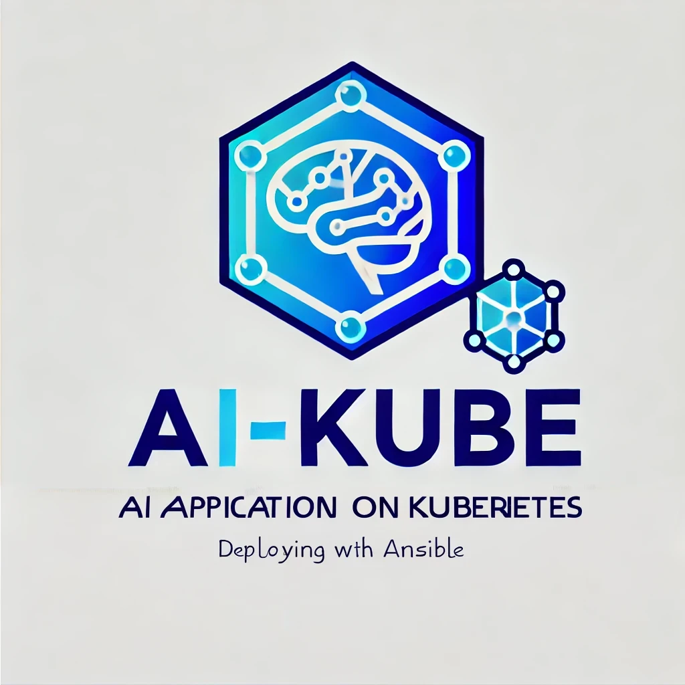

<h1 align="center" style="font-size: 3em; font-weight: bold; margin-bottom: 20px;">AI-Kube</h1>

<p align="center">
  
</p>

AI-Kube is a Kubernetes-based deployment for AI applications, featuring MinIO (ai-s3), Weaviate (ai-vdb), a Python environment (ai-py), and a frontend (ai-frontend).

## Components

### MinIO (ai-s3)
MinIO provides high-performance, S3-compatible object storage.

### Weaviate (ai-vdb)
Weaviate is a cloud-native, modular, real-time vector search engine.

### Python Environment (ai-py)
The Python environment for running the core AI application.

### Frontend Environment (ai-frontend)
The frontend interface for interacting with the AI application.

## Custom AI-Ops Kubernetes Infrastructure

Directory Structure

Create the following directory structure for organizing the Ansible playbooks and roles:

```
ai-kube/
├── group_vars/
│   └── all.yml
├── inventory/
│   └── hosts
├── roles/
│   ├── common/
│   │   └── tasks/
│   │       └── main.yml
│   ├── ai-s3/
│   │   ├── tasks/
│   │   │   └── main.yml
│   │   ├── templates/
│   │   │   ├── deployment.yml.j2
│   │   │   ├── pvc.yml.j2
│   │   │   ├── pv.yml.j2
│   │   │   └── secret.yml.j2
│   ├── ai-vdb/
│   │   ├── tasks/
│   │   │   └── main.yml
│   │   ├── templates/
│   │   │   └── deployment.yml.j2
│   ├── ai-py/
│   │   ├── tasks/
│   │   │   └── main.yml
│   │   ├── templates/
│   │   │   └── deployment.yml.j2
│   ├── ai-frontend/
│   │   ├── tasks/
│   │   │   └── main.yml
│   │   ├── templates/
│   │   │   └── deployment.yml.j2
└── playbook.yml
```

### Running the Playbook

1. **Navigate to the Ansible directory**:
   ```sh
   cd ansible
   ```

2. **Run the Ansible playbook**:
   ```sh
   ansible-playbook -i inventory/hosts playbook.yml
   ```

This completes the instructions for deploying the AI application using Ansible. Each component, including MinIO (`ai-s3`), Weaviate (`ai-vdb`), the Python AI application (`ai-py`), and the frontend (`ai-frontend`), is organized into roles and templates for a scalable and programmatic deployment. If you need further customization or adjustments, you can modify the respective templates and task files accordingly.

